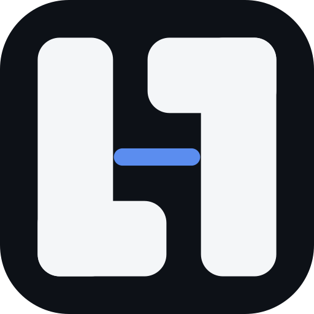
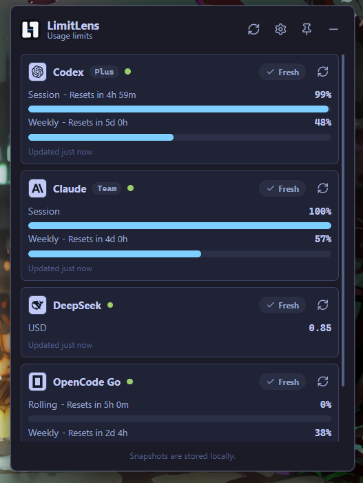

<p align="center">
  
</p>

<h1 align="center">LimitLens</h1>

<p align="center">
  A Windows tray app for checking AI usage limits, reset credits, and balances without opening every provider dashboard.
</p>

<p align="center">
  <a href="#download">Download</a> |
  <a href="#providers">Providers</a> |
  <a href="#glance-window">Glance</a> |
  <a href="#build-from-source">Build from source</a> |
  <a href="#security-and-privacy">Security</a>
</p>

---

It is built with Tauri, React, TypeScript, and Rust. Provider credentials and session data are kept in Windows Credential Manager where possible, and the UI shows sanitized usage summaries.

<p align="center">
  
</p>

## Providers

- OpenAI Codex: reads local Codex auth and shows quota/reset summary.
- Claude: reads local Claude credentials and shows session, weekly, and Fable 5 quota summary when exposed.
- OpenCode Go: shows authenticated Go limits from the OpenCode workspace page.
- DeepSeek: optional API balance check, showing USD balance.
- Antigravity: reads running-app usage where possible, with Windows Credential Manager / Cloud Code fallback.

The main window is currently the compact v0.1 tray panel: provider cards, refresh actions, setup in Settings, theme controls, periodic refresh, and a Focus/Dashboard size toggle. The larger dashboard/sidebar experiment was rolled back in v0.1.1 and will be revisited after a stronger design direction is chosen.

## Glance Window

LimitLens can show a tiny always-on-top glance window for the limits you check most often. It is draggable, remembers its position, and opens the main tray panel when clicked.

The glance window keeps the display intentionally terse:

```text
Provider icon  5h remaining % | weekly remaining %
Provider icon  5h remaining % | weekly remaining % | extra pool %
```

The default glance set is Codex, Claude, OpenCode, and Antigravity. Providers with multiple quota pools can show three values, such as Claude's Fable 5 pool or Antigravity's Gemini/Claude pools. The main tray panel remains the place for setup, refresh actions, detailed cards, and future analytics.

## Download

LimitLens publishes Windows builds through [GitHub Releases](https://github.com/Ruppy7/LimitLens/releases) when a version tag is cut.

- Unsigned NSIS installer: `LimitLens_<version>_x64-setup.exe`
- Portable zip: `LimitLens_<version>_x64-portable.zip`
- Checksums: `SHA256SUMS.txt`

The Windows builds are unsigned for now, so Windows may show SmartScreen or unknown-publisher warnings. If a newer source version has not been published as a release yet, build it from source.

## Build from Source

Clone the repo, install dependencies, and run it locally:

```powershell
git clone https://github.com/Ruppy7/LimitLens.git
cd LimitLens
npm install
npm run tauri dev
```

Build checks:

```powershell
npm run build
cd src-tauri
cargo test
```

Build a local Windows installer:

```powershell
npm run tauri -- build
```

The unsigned NSIS installer is written to:

```text
src-tauri\target\release\bundle\nsis\
```

Official signed release binaries are not published yet.

## OpenCode Go

OpenCode Go limits currently use an experimental cookie-backed flow:

1. Log in to OpenCode in your browser.
2. Open your Go workspace page:

```text
https://opencode.ai/workspace/<your-workspace-id>/go
```

3. In LimitLens Settings, paste either the workspace URL or the `wrk_...` id.
4. Paste the `Cookie` request header from that logged-in browser request.

The cookie is stored in Windows Credential Manager and used only by the Rust host to fetch quota fields. This may break if OpenCode changes the page shape or session behavior.

LimitLens displays OpenCode quota as remaining percentage, matching the other quota providers. Earlier development builds showed OpenCode as used percentage.

Alternative approach: OpenCode also keeps local usage data in `opencode.db`. Reading that database avoids browser cookies and is a viable future fallback, but it only reflects usage from that local device/profile, so it is less accurate than authenticated workspace quota for users who switch between Windows, WSL, or other machines.

## WSL

LimitLens is a Windows-native app, so it reads provider credentials from your Windows profile.

If you normally use provider CLIs inside WSL, sign in once from Windows so Windows has its own credentials. Alternatively, copy the relevant WSL credentials into the matching Windows profile folder. After that, refresh the provider in LimitLens.

## Caveats

- Windows is the primary target.
- Provider usage endpoints can change without notice.
- OpenCode Go support is experimental.
- Antigravity support depends on local app process shape, Credential Manager data, and Cloud Code endpoint behavior that may change.
- Windows installers are unsigned until code-signing is practical.
- Provider logos and names belong to their respective owners.

## Security and Privacy

- See [SECURITY.md](SECURITY.md) for vulnerability reporting and security expectations.
- See [PRIVACY.md](PRIVACY.md) for what stays local and what is sent to providers.
- See [THREAT_MODEL.md](THREAT_MODEL.md) for the current lightweight threat model.

## Planned

- Signed release packaging.
- Better provider setup flows and glance provider priority.
- A redesigned full dashboard for token spend, usage spend, history, and provider details.
- More providers such as Cursor, Devin, Copilot, xAI/Grok, OpenRouter, and Z.ai.

## License

MIT
